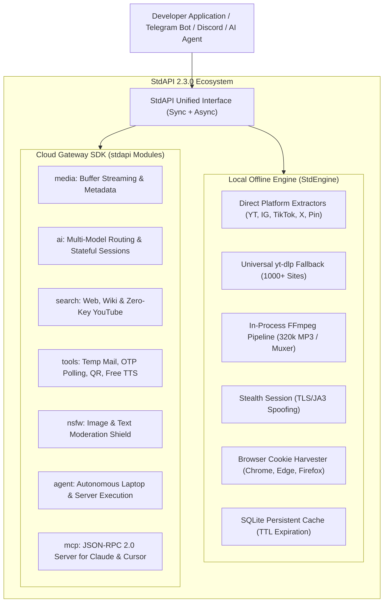

<div align="center">

# ⚡ StdAPI

### The Unified Open-Source API Platform for AI, Media, Search & Automation
**Built to power modern developers, bots, and real-world applications at scale.**

[](https://pypi.org/project/stdapi/)
[](https://pypi.org/project/stdapi/)
[](https://github.com/STD-DEEPANSHU/StdAPI/actions)
[](https://pypi.org/project/stdapi/)
[](LICENSE)
[](https://modelcontextprotocol.io/)
[](https://github.com/STD-DEEPANSHU/StdAPI/stargazers)

<br/>

*StdAPI brings together ultra-fast local offline media extraction, resilient cloud gateway orchestration, multi-model AI routing, zero-key YouTube & web search, automated developer utilities, and a native Model Context Protocol (MCP) server under one clean Python SDK.*

---

[Key Features](#-key-features) •
[Architecture](#-dual-engine-architecture) •
[Installation](#-installation) •
[Quickstart](#-quickstart-guides) •
[CLI & TUI](#-command-line-interface-cli--tui) •
[MCP Integration](#-model-context-protocol-mcp) •
[Comparison](#-competitive-matrix) •
[License](#-license--credits)

</div>

---

## 🚀 Key Features

- **⚡ Dual-Engine Operation:**
  - **Local Engine (`StdEngine`):** Zero-server offline extraction directly on your local machine or container. Employs real TLS/JA3 browser fingerprint spoofing, local browser cookie harvesting (Chrome, Edge, Firefox, Brave), and in-process FFmpeg stream muxing to bypass IP bans and login walls.
  - **Cloud SDK (`stdapi` / `StdAPIClient`):** High-throughput asynchronous & synchronous client connecting to global gateway nodes with automated retries, connection pooling, and resilient fallbacks.
- **🎬 Universal Media Downloader & Zero-Disk Streaming:**
  - Out-of-the-box support for **Instagram Reels/Stories/Posts, YouTube, TikTok (no watermark), Twitter/X, Pinterest**, and 1,000+ platforms supported by `yt-dlp`.
  - **Zero-Disk In-Memory Streaming (`get_buffer()`):** Direct `io.BytesIO` buffers so Telegram bots (`StdGram`, `Pyrogram`, `Telethon`) and Discord bots forward media directly to users without touching the local disk.
  - **Chunked Stream Generator (`media.stream()`):** High-speed streaming chunks for FastAPI `StreamingResponse` with constant memory usage.
- **🧠 Multi-Model AI Orchestration (`stdapi.ai`):**
  - Seamlessly prompt **GPT-4o, GPT-4o-mini, Claude 3.5 Sonnet, Gemini 1.5/2.0, DeepSeek-V3/R1, and Mistral**.
  - **Multi-turn Conversational Sessions (`AISession`):** Stateful chat with automatic message history and memory management.
  - **Structured JSON Mode (`ai.structured`):** Strictly enforced schema output without markdown artifacts.
- **🔍 Zero-Key Search Hub (`stdapi.search`):**
  - **YouTube Music & Track Search (`search.youtube`):** Instant search returning titles, durations, channels, and URLs **without any Google API key** — indispensable for Telegram Music Bots (`StdMusic`, `VuxMusic`).
  - **Web & News Search:** Instant web snippets and real-time news aggregation.
  - **Wikipedia Knowledge Base:** Summaries, thumbnails, and canonical source references.
- **🛠️ Automation & Developer Suite (`stdapi.tools`):**
  - **Disposable Temp Mail with Autonomous OTP Poller (`wait_for_otp`):** Auto-polls incoming emails until verification codes arrive.
  - **In-Memory QR Code Generator (`qr_buffer`):** Direct `BytesIO` PNG image buffers ready for bot replies.
  - **Free In-Memory Text-to-Speech (`tts`):** Real-time MP3 voice buffers without requiring paid speech API tokens.
  - **IP Geolocation, Crypto & Currency Tickers:** Live rates for BTC, ETH, USD, EUR, and comprehensive IP/ISP lookups.
- **🛡️ Anti-NSFW & Content Moderation (`stdapi.nsfw`):**
  - Scans image URLs, raw bytes, `BytesIO`, base64 strings, or file paths for explicit/18+ content.
  - `nsfw.is_safe()` helper for Telegram bot group shield middleware.
- **🔌 Model Context Protocol (MCP) Server (`stdapi mcp`):**
  - Built-in stdio server with **11 native developer tools** ready for **Claude Desktop, Cursor IDE, Windsurf, Zed, and AI Coding Agents**.
- **🔄 Universal Dual Execution:**
  - Both native **Async (`await`)** and **Sync (`from stdapi import sync`)** interfaces for 100% compatibility across Flask, Django, Celery, Jupyter, and FastAPI.

---

## 🏛️ Dual-Engine Architecture



---

## 📦 Installation

```bash
# Install core package
pip install -U stdapi

# With browser cookie harvesting (Chrome/Edge/Firefox)
pip install -U "stdapi[cookies]"

# With FastAPI streaming microservice support
pip install -U "stdapi[fastapi]"

# Full bundle (cookies, FastAPI, QR image engine)
pip install -U "stdapi[all]"
```

---

## ⚡ Quickstart Guides

### 1. Telegram Media Bot (StdGram / Pyrogram) — Zero-Disk Downloader

```python
import os
from stdapi import media
from stdgram import Client, filters

app = Client("StdMediaBot", api_id=12345, api_hash="your_hash", bot_token="your_token")

@app.on_message(filters.regex(r"https?://[^\s]+"))
async def download_handler(client, message):
    url = message.matches[0].group(0)
    msg = await message.reply_text("⚡ Processing media link with StdAPI...")

    # Fetch direct video stream into in-memory buffer without saving to disk
    buf = await media.get_buffer(url, format="mp4")

    await message.reply_video(video=buf, caption="Downloaded via StdAPI")
    await msg.delete()

app.run()
```

---

### 2. Telegram Music Bot — Zero-Key YouTube Search & 320kbps MP3 Streaming

```python
from stdapi import media, search
from stdgram import Client, filters

app = Client("MusicBot", api_id=12345, api_hash="your_hash", bot_token="your_token")

@app.on_message(filters.command("play"))
async def play_music(client, message):
    query = " ".join(message.command[1:])
    status = await message.reply_text(f"🔍 Searching YouTube for: `{query}`...")

    # 1. Search YouTube without Google API key
    res = await search.youtube(query, limit=1)
    track = res.results[0]

    # 2. Extract high-bitrate MP3 audio directly into in-memory buffer
    audio_buf = await media.get_buffer(track.url, format="mp3", mode="audio")

    # 3. Send audio directly to user
    await message.reply_audio(
        audio=audio_buf,
        title=track.title,
        performer=track.channel,
        duration=int(track.duration or 0)
    )
    await status.delete()

app.run()
```

---

### 3. Telegram Group Anti-NSFW Moderation Guard

```python
from stdapi import nsfw
from stdgram import Client, filters

app = Client("NSFWGuard", api_id=12345, api_hash="your_hash", bot_token="your_token")

@app.on_message(filters.group & (filters.photo | filters.sticker))
async def scan_group_media(client, message):
    media_buf = await client.download_media(message, in_memory=True)

    # 1-Line boolean check: returns True if safe, False if explicit/NSFW
    if not await nsfw.is_safe(media_buf, threshold=0.65):
        await message.delete()
        await message.reply_text("⚠️ Explicit media removed by StdAPI Guard.")

app.run()
```

---

### 4. Synchronous Execution (Flask, Django, Celery, Scripts)

Zero `asyncio` boilerplate required:

```python
from stdapi import sync

# 1. Download media directly
buf = sync.media.get_buffer("https://www.instagram.com/reel/Cxxxxxx/")

# 2. Search web & YouTube
tracks = sync.search.youtube("Arijit Singh romantic mashup", limit=3)
print(tracks.results[0].title)

# 3. Developer tools
mail = sync.tools.temp_mail()
print(f"Disposable Email: {mail.email}")

# 4. Free Text-to-Speech in-memory MP3 buffer
voice_buf = sync.tools.tts("Welcome to StdAPI platform", lang="en")
with open("welcome.mp3", "wb") as f:
    f.write(voice_buf.getvalue())
```

---

### 5. Multi-Turn AI Chat Sessions with Memory

```python
import asyncio
from stdapi import ai

async def main():
    # Create stateful conversation session
    session = ai.create_session(
        system_prompt="You are a senior systems engineer.",
        model="gpt-4o-mini"
    )

    r1 = await session.ask("What is the difference between TCP and UDP?")
    print("AI:", r1.response)

    r2 = await session.ask("Give me a Python socket example of UDP.")
    print("AI:", r2.response)

asyncio.run(main())
```

---

### 6. Automated Temp-Mail OTP Polling

```python
import asyncio
from stdapi import tools

async def main():
    # 1. Create temporary disposable mailbox
    box = await tools.temp_mail()
    print(f"Mailbox: {box.email}")

    print("Waiting for incoming verification code...")
    # 2. Autonomous polling: waits up to 60s until an OTP code arrives
    otp_data = await tools.wait_for_otp(box.login, box.domain, timeout=60)

    if otp_data.success:
        print(f"✓ Extracted OTP: {otp_data.otp_code}")
        print(f"Subject:        {otp_data.subject}")
    else:
        print("OTP wait timed out.")

asyncio.run(main())
```

---

## 💻 Command-Line Interface (CLI) & TUI

StdAPI provides a rich, color-coded terminal CLI:

```bash
# Interactive Diagnostics Dashboard
stdapi tui

# Inspect & extract direct stream URL from any link
stdapi extract "https://www.youtube.com/watch?v=dQw4w9WgXcQ"

# Download video or audio file directly
stdapi download "https://www.instagram.com/reel/Cxxxxxx/" -f mp4 -o reel.mp4

# Search YouTube without an API key
stdapi search "Alan Walker Faded" --yt

# Search the Web or Wikipedia
stdapi search "Quantum Computing" --wiki

# Query AI models directly in terminal
stdapi ai "Explain Paxos algorithm in simple terms" -m gpt-4o-mini

# Developer utilities
stdapi tools --temp-mail
stdapi tools --ip
stdapi tools --qr "https://github.com/STD-DEEPANSHU/StdAPI"
stdapi tools --crypto BTC
stdapi tools --currency 100 USD INR

# Scan image or file for NSFW content
stdapi nsfw sample.jpg

# Convert media to 320kbps MP3
stdapi convert video.mp4 audio.mp3 -b 320k

# Purge OS temporary junk cache
stdapi clean

# Start Model Context Protocol (MCP) server
stdapi mcp
```

> **Pro Tip:** Add `--json` to any command for machine-parseable JSON output in shell scripts!
> ```bash
> stdapi tools --ip --json | jq .country
> ```

---

## 🔌 Model Context Protocol (MCP)

StdAPI features a production-ready stdio MCP server exposing **11 developer tools** to AI coding agents.

### Configure with Claude Desktop or Cursor IDE:

Add this snippet to your `claude_desktop_config.json`:

```json
{
  "mcpServers": {
    "stdapi": {
      "command": "stdapi",
      "args": ["mcp"]
    }
  }
}
```

### Exposed MCP Tools:

| MCP Tool | Description |
|:---|:---|
| `extract_media` | Extract direct stream URLs, thumbnails, and durations from YouTube, IG, TikTok, X, Pinterest |
| `convert_media` | In-process FFmpeg conversion to 320kbps MP3 or lossless trimming |
| `search_web` | Query web search for live snippets and references |
| `search_youtube` | Zero-key YouTube music and video discovery |
| `search_wiki` | Complete Wikipedia summaries, thumbnails, and links |
| `ai_chat` | Prompt GPT-4o, Claude 3.5, Gemini, or DeepSeek |
| `temp_mail_create`| Instantiate active disposable email address |
| `temp_mail_inbox` | Read incoming inbox and OTP verification codes |
| `ip_lookup` | High-fidelity IP geolocation and network details |
| `generate_qr_code`| Instant Base64 data URL QR code generation |
| `scan_nsfw` | Scan images for 18+ explicit content |

---

## 📊 Competitive Matrix

| Feature | StdAPI | yt-dlp | SafoneAPI | Pytube |
|:---|:---:|:---:|:---:|:---:|
| **Local Offline Extractor** | ✅ Yes (`StdEngine`) | ✅ Yes | ❌ No (Cloud only) | ⚠️ YouTube only |
| **Cloud API Gateway** | ✅ Yes | ❌ No | ✅ Yes | ❌ No |
| **Zero-Disk In-Memory Buffer** | ✅ Yes (`get_buffer`) | ⚠️ Manual code | ⚠️ Limited | ⚠️ Manual code |
| **Chunked Stream Generator** | ✅ Yes (`media.stream`) | ❌ No | ❌ No | ❌ No |
| **Telegram Bot Native Support** | ✅ StdGram / Pyrogram | ⚠️ Wrapper needed | ✅ Yes | ❌ No |
| **Zero-Key YouTube Search** | ✅ Yes | ⚠️ Complex CLI | ❌ No | ⚠️ Unreliable |
| **Stateful AI Chat & Sessions** | ✅ Yes | ❌ No | ⚠️ Basic chat | ❌ No |
| **Disposable Mail & Auto OTP** | ✅ Yes | ❌ No | ⚠️ Basic inbox | ❌ No |
| **In-Memory Free TTS Buffer** | ✅ Yes | ❌ No | ❌ No | ❌ No |
| **Anti-NSFW Moderation Shield** | ✅ Yes | ❌ No | ✅ Yes | ❌ No |
| **In-Process FFmpeg Controller** | ✅ Yes | ⚠️ Subprocess | ❌ No | ❌ No |
| **Model Context Protocol (MCP)**| ✅ Yes (11 Tools) | ❌ No | ❌ No | ❌ No |
| **Dual Async & Sync Engine** | ✅ Yes | ⚠️ Sync only | ⚠️ Async only | ⚠️ Sync only |
| **Automated Test Coverage** | ✅ 20/20 Passing | ✅ Yes | ❌ Untested | ❌ Broken |

---

## 🛠️ Python SDK Module Reference

```python
from stdapi import media, ai, search, tools, nsfw, agent, sync, StdEngine

# Media Engine
res = await media.info(url)
res = await media.download(url, format="mp4")
buf = await media.get_buffer(url, format="mp4") # Zero disk I/O
async for chunk in media.stream(url): ...        # Chunk streaming

# Search Hub
res = await search.youtube("Arijit Singh", limit=5) # Zero-key YouTube search
res = await search.web("Python asyncio tutorial")   # Web search
res = await search.wiki("Alan Turing")              # Wikipedia lookup

# AI Intelligence
res = await ai.chat("Explain quantum entanglement", model="gpt-4o-mini")
session = ai.create_session(model="gpt-4o-mini")    # Stateful session
res = await ai.code("Merge sort in python", language="python")

# Developer Tools
mail = await tools.temp_mail()
otp  = await tools.wait_for_otp(mail.login, mail.domain)
qr   = await tools.qr_buffer("https://stdapi.com")
geo  = await tools.ip()
tts  = await tools.tts("Hello developer", lang="en")
rate = await tools.crypto("BTC")

# NSFW Moderation
safe = await nsfw.is_safe(image_bytes)

# Local Embedded Engine (Zero Remote Servers)
engine = StdEngine()
res = await engine.extract("https://www.instagram.com/reel/Cxxxxxx/")
```

---

## 🤝 Contributing

Contributions are warmly welcomed! To get started:

1. Fork the repository on GitHub.
2. Clone your fork locally:
   ```bash
   git clone https://github.com/STD-DEEPANSHU/StdAPI.git
   cd StdAPI
   ```
3. Install development dependencies:
   ```bash
   pip install -e ".[all]" pytest
   ```
4. Run the test suite:
   ```bash
   pytest -v
   ```
5. Submit a clean Pull Request with descriptive commit messages.

---

## 📜 License & Legal Attribution

StdAPI is released under the **GNU Lesser General Public License v3.0 (LGPLv3)**.  
See [LICENSE](LICENSE) and [NOTICE](NOTICE) for complete terms.

```
Copyright (C) 2024-2026 STD-DEEPANSHU <stddeepanshu@aol.com>
Engineered by STD-DEEPANSHU under TeamStdNetwork.
```

<div align="center">
  <sub>Built with ❤️ by <a href="https://github.com/STD-DEEPANSHU">STD-DEEPANSHU</a> and the <a href="https://github.com/TeamStdNetwork">TeamStdNetwork</a> developer collective.</sub>
</div>
